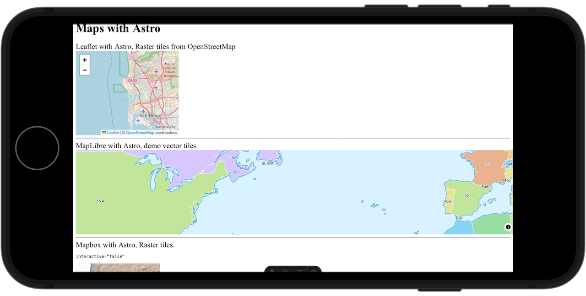
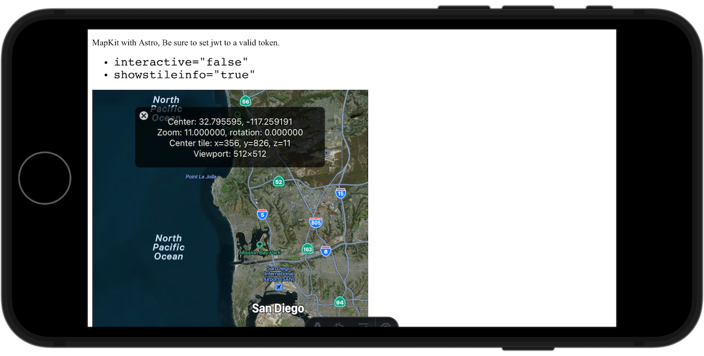

[][vscode.dev]

[vscode.dev]: https://vscode.dev/github/roblabs/maps-withastro "A lightweight version of VS Code running fully in the browser."

# Creating an Astro Component template for Web Maps

https://Astro.build is a great start for creating web sites.  This project allows you to bring Leaflet & MapLibre maps directly into Astro.

## Demo

The Astro Docs has a section on creating a `demo` directory for testing and demonstrating the component.  See https://docs.astro.build/en/reference/publish-to-npm/#creating-a-package

We followed these notes to add `demo/` in the root of this project.  The Demo project supports Astro & MDX examples of displaying a map.

    ├── demo
    │   ├── public
    │   │   ├── favicon.svg
    │   │   └── jwt
    │   ├── src
    │   │   └── pages
    │   │       ├── index.astro
    │   │       └── mapkit.mdx

## Astro Component

To create the template, we started with the official Astro template `component` and started this project called `maps-withastro`.  See https://github.com/withastro/astro/tree/main/examples/component.

```bash
pnpm create astro@latest maps-withastro -- --template component
```

```bash
# done for you, left here for replication notes
# pnpm create astro@latest demo -- --template minimal
```

Astro + Leaflet, MapLibre or Mapbox



---

Astro + MapKit



## Architecture

The architecture is to pass in Astro properties via an HTMLElement dataset property.  The pattern for the Leaflet map example is from an Astro project called `hello-astro`.  

```JavaScript
// Copyright (c) 2022 Hello Tham Pty Ltd.  https://github.com/hellotham/hello-astro 
// SPDX-License-Identifier: MIT
```

See https://developer.mozilla.org/en-US/docs/Web/API/HTMLElement/dataset
 
### Leaflet with Astro

See [demo/src/pages/index.astro](demo/src/pages/index.astro).

```jsx
import { Leaflet } from 'maps-withastro';
---
<Leaflet
  container="leafletmap"
  latitude={32.795595}
  longitude={-117.259191}
  zoom={10}
  tileLayer="https://{s}.tile.openstreetmap.org/{z}/{x}/{y}.png"
  attribution="© <a href='https://www.openstreetmap.org/copyright'>OpenStreetMap</a> contributors"
  containerstyle="width: 312px; height: 256px"
/>
```

### MapLibre with Astro

```jsx
import { MapLibre } from 'maps-withastro';
---
<MapLibre
  container="maplibremap"
  latitude="32.795595"
  longitude="-117.259191"
  zoom="3"
  interactive="true"
  mapstyle="https://demotiles.maplibre.org/style.json"
  containerstyle="width: 312px; height: 256px"
/>
```

### Mapbox with Astro

```jsx
<Mapbox
  container="mapboxmap"
  latitude={latitude}
  longitude={longitude}
  zoom={zoom}
  mapstyle={mapstyle}
  interactive="false"
/>
```

### MapKit with Astro

* Use either `zoom` or `cameradistance`.  If both are given, then `zoom` is preferred.
* Pass in JSON Web Token as either a URL or string
  * jwt="http://localhost:3141/jwt"
  * jwt="eyJhxGciO...."

```jsx
import { MapKit } from 'maps-withastro';
---
<MapKit
  container="mapkitmap"
  containerstyle="width: 512px; height: 512px"
  latitude={32.795595}
  longitude={-117.259191}
  cameradistance={10000}
  zoom={10}
  interactive="false"
  maptype="MutedStandard"
  showstileinfo="true"
  jwt="http://localhost:3141/jwt"
/>
```

# How to Replicate

Here are the steps taken to create this repo containing the Maps with Astro components. See https://docs.astro.build/en/reference/publish-to-npm

You can make use of these notes if you want to extend the Map components with Astro beyond Leaflet or MapLibre.

### Leaflet dependencies

```bash
# done for you, left here for replication notes
# pnpm install leaflet --workspace-root
# pnpm install @types/leaflet --save-dev --workspace-root
```

### MapLibre dependencies

```bash
# done for you, left here for replication notes
# pnpm install maplibre-gl --workspace-root
```

### Mapbox dependencies

```bash
# done for you, left here for replication notes
# pnpm install mapbox-gl --workspace-root
```

### MapKit dependencies

For detailed information on the required fields for the JWT header and payload, see [Creating and Using Tokens with MapKit JS](https://developer.apple.com/documentation/mapkitjs/creating_and_using_tokens_with_mapkit_js).  The [MapKit JS Dashboard](https://maps.developer.apple.com/token-maker) also has a tool called *Create a Token*.

```bash
# done for you, left here for replication notes
# pnpm install @types/apple-mapkit-js-browser --save-dev --workspace-root
```

## 🧞 Commands

All commands are run from the root of the project, from a terminal:

| Command                    | Action                                           |
| :------------------------- | :----------------------------------------------- |
| `npm link`                 | Registers this package locally. for use with `./demo` |
| `pnpm link maps-withastro` | Run in the `demo/` Astro project to install your components |
| `npm publish`              | [Publishes](https://docs.npmjs.com/creating-and-publishing-unscoped-public-packages#publishing-unscoped-public-packages) this package to NPM. Requires you to be [logged in](https://docs.npmjs.com/cli/v8/commands/npm-adduser) |
